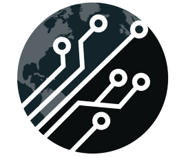
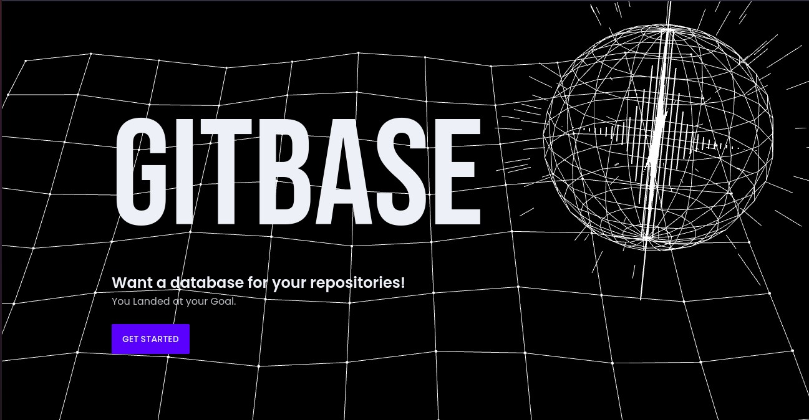

<div align="center">
  <a href="http://gitbase.sytes.net">
    
  </a>
  <br />
  <p>
    <h3>
      <b>
        Gitbase
      </b>
    </h3>
  </p>
  <p>
    <b>
      A github alternative built using NextJS and Django
    </b>
  </p>
  <p>

[](README.md)
[](http://gitbase.sytes.net)

  </p>
  <p>
    <sub>
      Built with ❤︎ by
      <a href="http://github.com/Arunjoseph3007/github-clone-frontend/graphs/contributors">
        contributors
      </a>
    </sub>
  </p>
  <br />
  <p>
    <a href="http://gitbase.sytes.net" target="_blank">
      
    </a>
  </p>
</div>

> NOTE:
> If you cant tell already this is not a production ready software. This was meant for understanding the basics of how remote git servers, especially their authentication systems works. 

## Features

- You can make remote copies of your repositories.
- Collaborate with anyone across the world that you want.
- Completely free and open source

## Technology used

- Frontend
  - React (Frontend Framework)
  - NextJS (Server Rendering)
  - Tailwindcss (CSS Framework)
  - DaisyUI (UI Framework)
- Backend
  - Django
  - Django rest Framework
- Server
  - Apache (Web server)
  - Google Cloud Platform (Cloud server)

## Build

### Entire Project
```sh
docker-compose up --build
```

### Just Frontend
```sh
docker build -t gitbase-frontend:latest .
```

## Authors

- [@bhavikshah2002](https://www.github.com/bhavikshah2002)
- [@Arunjoseph3007](https://www.github.com/Arunjoseph3007)
- [@Arpit472002](https://www.github.com/Arpit472002)
